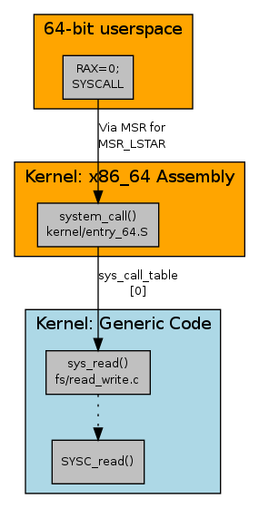

# Sentry

本文主要讨论的是**gVisor**里面的核心部分——**sentry**。

### Set Up

首先，和一开始一样，我们先在日志文件当中搜索关于**sentry**的信息，但是日志文件当中并没有相关的内容，于是进入源代码的工程目录下，在全局搜索`sentry`关键字，找到了有`/pkg/sentry`目录，由此发现了**sentry**的相关信息。

由于本次的相关研究都是结合**kvm**平台来展开的，所以转到`/pkg/sentry/platform/kvm/kvm.go`文件。发现该文件当中有`New()`函数，因此在全局搜索`kvm.New()`，找到了调用的地方，在`runsc/boot/loader.go`文件当中。所以，后续的研究，可以以此为切入点展开，具体来看一下，有关**sentry**的部分是在何时、如何初始化和运用的。它在**gVisor**的运作过程当中扮演了什么样的角色。

```go
// runsc/boot/loader.go
func createPlatform(conf *Config, deviceFile *os.File) (platform.Platform, error) {
	switch conf.Platform {
	case PlatformPtrace:
		log.Infof("Platform: ptrace")
		return ptrace.New()
	case PlatformKVM:
		// add by zty in oder to watch stack trace
		// using "runtime/debug" PrintStack() -> Maybe use runtime.Stack() can collect the info and output to log
		// db.PrintStack()
		log.Infof("Platform: kvm")
		if deviceFile == nil {
			return nil, fmt.Errorf("kvm device file must be provided")
		}
		return kvm.New(deviceFile)
	default:
		return nil, fmt.Errorf("invalid platform %v", conf.Platform)
	}
}
```

在`loader.go`文件当中找到调用`kvm.New()`的位置，插入`stack trace`函数，这里为了避免和gVisor工程里面的`debug`重名，所以引入`runtime/debug`的时候重命名为`db`。重新编译运行之后，得到了如下的**Stack Trace**，注意这里的**Stack Trace**和之前不同，并不是输出在命令行里面的，而是输出在`.boot`日志文件里面的，我推断是在这个时候已经做到了隔离，即把`stdout`标准化输出重定向到了`.boot`日志文件。

```
goroutine 1 [running]:
runtime/debug.Stack(0x8, 0x3, 0x1)
	GOROOT/src/runtime/debug/stack.go:24 +0x9d
runtime/debug.PrintStack()
	GOROOT/src/runtime/debug/stack.go:16 +0x22
gvisor.googlesource.com/gvisor/runsc/boot.createPlatform(0xc0001a4000, 0xc0000a6940, 0x0, 0x9, 0x5de, 0x3)
	runsc/boot/loader.go:414 +0x42
gvisor.googlesource.com/gvisor/runsc/boot.New(0x7ffe3753afa8, 0x40, 0xc0000ad180, 0xc0001a4000, 0x5, 0xc0000a6940, 0xc0000995c0, 0x4, 0x4, 0xc0000995e0, ...)
	runsc/boot/loader.go:188 +0x256
gvisor.googlesource.com/gvisor/runsc/cmd.(*Boot).Execute(0xc000192120, 0xe384c0, 0xc00009c010, 0xc0001964e0, 0xc000158a60, 0x2, 0x2, 0x0)
	runsc/cmd/boot.go:224 +0xa9b
github.com/google/subcommands.(*Commander).Execute(0xc0000ac000, 0xe384c0, 0xc00009c010, 0xc000158a60, 0x2, 0x2, 0xc000034500)
	external/com_github_google_subcommands/subcommands.go:141 +0x2fb
github.com/google/subcommands.Execute(...)
	external/com_github_google_subcommands/subcommands.go:371
main.main()
	runsc/main.go:251 +0x1452
```

通过第10行的函数名我们发现，这里的调用发生在运行`boot`命令的时候，这与stack输出在`.boot`日志文件是相一致的。

这里我们先观察以下`runsc/cmd/boot.go`文件，看看究竟做了什么事情。

```go
	// Create the loader.
	bootArgs := boot.Args{
		ID:           f.Arg(0),
		Spec:         spec,
		Conf:         conf,
		ControllerFD: b.controllerFD,
		Device:       os.NewFile(uintptr(b.deviceFD), "platform device"),
		GoferFDs:     b.ioFDs.GetArray(),
		StdioFDs:     b.stdioFDs.GetArray(),
		Console:      b.console,
		NumCPU:       b.cpuNum,
		TotalMem:     b.totalMem,
		UserLogFD:    b.userLogFD,
	}
	l, err := boot.New(bootArgs)
	if err != nil {
		Fatalf("creating loader: %v", err)
	}
```

这里截取的是调用`boot.New()`的上下文代码，根据注释可以了解到这里进行的操作是`create loader`。

**loader**具体是做什么的，还有待进一步的完善，先继续看`boot.new()`这个函数里做了什么。

首先研究一下注释。

```go
// New initializes a new kernel loader configured by spec.
// New also handles setting up a kernel for restoring a container.
func New(args Args) (*Loader, error) {
```

这是`runsc/boot/loader.go`文件当中`New()`函数的注释。注释的意思大概就是，这个函数根据`spec`的设置初始化了一个`kernel loader`，同时处理设置用于恢复容器的内核。那么这里的`New()`函数意思应该是差不多清楚了，一个是`initialize a kernel loader`，另一个是`set up a kernel`。

#### Create kernel and platform

由于这篇文章主要研究的是sentry的部分，所以在这里先关注一下引用到sentry目录下的操作。

```go
// runsc/boot/loader.go
	// Create kernel and platform.
	p, err := createPlatform(args.Conf, args.Device)
	if err != nil {
		return nil, fmt.Errorf("creating platform: %v", err)
	}
	k := &kernel.Kernel{
		Platform: p,
	}
```

这里便是`New()`函数当中涉及到sentry的第一个部分，后续还有没有现在未知，这里从注释看出是创建`kernel`和`platform`，从代码的编写上看到首先是调用`createPlatform()`函数并赋值给变量`p`，再利用`p`新建`kernel`对象赋值给`k`。

这里主要涉及到两个函数，一个是`createPlatform()`，一个是`kernel.Kernel`构造函数。

首先看`createPlatform()`，这个函数在文章的一开始就被找到了，这个函数根据`conf.platform`的值来选择新建不同的`platform`，在这里由于设置了`platform=kvm`所以调用`kvm.New()`来创建`kvm`平台。

转到`pkg/sentry/platform/kvm/kvm.go`文件，这里定义了`kvm.New()函数`。

```go
// New returns a new KVM-based implementation of the platform interface.
func New(deviceFile *os.File) (*KVM, error) {
    fd := deviceFile.Fd()	// 获取文件描述符，info: https://golang.org/pkg/os/#File.Fd

	// Ensure global initialization is done.
	globalOnce.Do(func() {
		physicalInit()
		globalErr = updateSystemValues(int(fd))
		ring0.Init(cpuid.HostFeatureSet())
	})
	if globalErr != nil {
		return nil, globalErr
	}

	// Create a new VM fd.
    // _KVM_CREATE_VM defined in pkg/sentry/platform/kvm/kvm_const.go
	vm, _, errno := syscall.RawSyscall(syscall.SYS_IOCTL, fd, _KVM_CREATE_VM, 0) 
	if errno != 0 {
		return nil, fmt.Errorf("creating VM: %v", errno)
	}
	// We are done with the device file.
	deviceFile.Close()

	// Create a VM context.
    // newMachine() defined in pkg/sentry/platform/kvm/machine.go
	machine, err := newMachine(int(vm))
	if err != nil {
		return nil, err
	}

	// All set.
	return &KVM{
		machine: machine,
	}, nil
}
```

这个函数主要的工作就是——初始化物理资源、创建VM文件描述符、创建VM context，返回KVM对象。

×××具体的内容有待进一步完善，这里用到了`Linux ioctl()`系统调用，其工作原理比较复杂，考虑后续进一步去了解。

×××之前说到一系列的输出都在`.boot`文件里面，所以可以利用`.boot`文件的内容来研究`sentry`的初始化。

在初步研究这些之后，我判断关于`sentry`的创建和初始化，应该都是在`runsc/boot/loader.go`这个文件里面定义的，所以接下来继续研究这个文件。

#### Create memory file

```go
// runsc/boot/loader.go
	// Create memory file.
	mf, err := createMemoryFile()
	if err != nil {
		return nil, fmt.Errorf("creating memory file: %v", err)
	}
	k.SetMemoryFile(mf)
```

依据注释，这段代码的目的是创建`memory file`，这里的`memory file`到底是什么，现在并不是很清楚，进入函数看一下。

```go
// runsc/boot/loader.go
func createMemoryFile() (*pgalloc.MemoryFile, error) {
	const memfileName = "runsc-memory"
	memfd, err := memutil.CreateMemFD(memfileName, 0)
	if err != nil {
		return nil, fmt.Errorf("error creating memfd: %v", err)
	}
	memfile := os.NewFile(uintptr(memfd), memfileName)
	mf, err := pgalloc.NewMemoryFile(memfile, pgalloc.MemoryFileOpts{})
	if err != nil {
		memfile.Close()
		return nil, fmt.Errorf("error creating pgalloc.MemoryFile: %v", err)
	}
	return mf, nil
}
```

`memutil.CreateMemFD()`创建了一个`memfd`文件并返回文件描述符`fd`，`os.NewFile()`返回具有给定文件描述符和名称的新文件，在[网上](<https://segmentfault.com/a/1190000000376807>)看到关于这个说法，是`这个函数并不是真的创建了一个文件，是新建一个文件不保存，然后返回文件的指针`。

×××我也不知道这里为什么要先创建`memfd`然后再利用它去新建一个文件，暂且往下看。

`pgalloc.NewMemoryFile()`函数的定义位于`pkg/sentry/pgalloc/pgalloc.go`，它的注释是如下

```go
// NewMemoryFile creates a MemoryFile backed by the given file. If
// NewMemoryFile succeeds, ownership of file is transferred to the returned MemoryFile.
func NewMemoryFile(file *os.File, opts MemoryFileOpts) (*MemoryFile, error) {
```

简单的翻译一下，就是创建由**给定文件**支持的**内存文件**，且如果这个函数成功返回，之前的给定文件的所有权会被转移到返回的内存文件上。

这里主要集中几个概念，什么是`given file`，`MemoryFile`，还有这里的`ownership`是什么。

×××这些都有待进一步完善，不过经由这个部分，可以了解到`pkg/sentry/pgalloc`主要做的内存分配这一块的工作。

笼统的来说就是从`memfd`->`file`->`MemoryFile`这三步，然后把创建好的`MemoryFile`送入`kernel`的参数当中。

#### Create VDSO

```go
// runsc/boot/loader.go
	// Create VDSO.
	//
	// Pass k as the platform since it is savable, unlike the actual platform.
	vdso, err := loader.PrepareVDSO(k)
	if err != nil {
		return nil, fmt.Errorf("creating vdso: %v", err)
	}
```

这里的`loader.PrepareVDSO()`位于`pkg/sentry/loader/vdso.go`，注释如下

```go
// PrepareVDSO validates the system VDSO and returns a VDSO, containing the
// param page for updating by the kernel.
func PrepareVDSO(mfp pgalloc.MemoryFileProvider) (*VDSO, error) {
```

这里的`VDSO`是Linux里的一个机制，我从[网上](<https://en.wikipedia.org/wiki/VDSO>)找了一段比较好的解释

vDSO (virtual dynamic shared object) is a kernel mechanism for exporting a carefully selected set of kernel space routines to user space applications so that applications can call these kernel space routines in-process, without incurring the performance penalty of a context switch that is inherent when calling these same kernel space routines by means of the system call interface.

简要的说就是通过减少`context switch`来加速user space的程序运行速度。也可以参考[这个文章](<http://adam8157.info/blog/2011/10/linux-vdso/>)。

那么之前一段注释的翻译`PrepareVDSO验证系统VDSO并返回一个VDSO，其中包含用于内核更新的param页面`就可以理解成，这个函数验证了`host OS`的`VDSO`，并返回了一个用于`updating by the kernel`的`param page`。

×××至于`VDSO`和`param page`的具体细节，在这里不做探讨，因为对此没有了解，有机会进一步深入。

这一节也可以表现出在`pkg/sentry/loader`目录下，做了一些关于系统相关加载的工作。也可以发现，sentry其实在试图做一个微型的kernel。

#### Create timekeeper

```go
// runsc/boot/loader.go
	// Create timekeeper.
	tk, err := kernel.NewTimekeeper(k, vdso.ParamPage.FileRange())
	if err != nil {
		return nil, fmt.Errorf("creating timekeeper: %v", err)
	}
	tk.SetClocks(time.NewCalibratedClocks())

	if err := enableStrace(args.Conf); err != nil {
		return nil, fmt.Errorf("enabling strace: %v", err)
	}
```

从简单的注释翻译来看，这里的操作就是创建`计时器-timekeeper`，从`kernel.NewTimekeeper()`函数所在的`pkg/sentry/kernel/timekeeper.go`文件当中，我们可以看到对`TimeKeeper`的定义——`Timekeeper manages all of the kernel clocks`。因此这里进行的是`sentry`的试钟创建和初始化。

定义如下

```go
// NewTimekeeper returns a Timekeeper that is automatically kept up-to-date.
// NewTimekeeper does not take ownership of paramPage.
//
// SetClocks must be called on the returned Timekeeper before it is usable.
func NewTimekeeper(mfp pgalloc.MemoryFileProvider, paramPage platform.FileRange) (*Timekeeper, error) {
	return &Timekeeper{
		params: NewVDSOParamPage(mfp, paramPage),
	}, nil
}
```

根据`vdso.ParamPage.FileRange()`和`NewVDSOParamPage()`创建了新的`Timekeeper`。

×××这里关于`VDSO ParamPage`的理解暂时停留在一种可以被user space访问的内存文件上。

在`SetClocks()`之后，关于`Timekeeper`的操作就完成了。

在这个部分用到了`pkg/sentry/`下的`kernel`目录，在这个目录下同样有`vdso`文件，但和`/loader`目录下的`vdso`文件不同，这个文件主要定义了`VDSOParamPage`这个结构，用于管理`VDSO parameter page`。

**`kernel`这个目录应该相当的重要，之后要仔细去研究一下这个目录的内容。**

#### Create network stack

```go
// runsc/boot/loader.go
	// Create an empty network stack because the network namespace may be empty at
	// this point. Netns is configured before Run() is called. Netstack is
	// configured using a control uRPC message. Host network is configured inside
	// Run().
	networkStack, err := newEmptyNetworkStack(args.Conf, k)
	if err != nil {
		return nil, fmt.Errorf("creating network: %v", err)
	}
```

这里注释当中的`Run()`函数，就位于`runsc/boot/loader.go`文件当中，我推断应该是启动容器的一个函数。

这里主要做的就是创建一个空的`network stack`，至于这个`network stack`到底是什么，我现在也不知道，但肯定和网络信息传递有关，要做到和`host`的隔离，那么网络参数也要分开来处理，所以这里的`network stack`应该也是为这个目的服务的。后续可以考虑从`network namespace`切入来研究。

```go
func newEmptyNetworkStack(conf *Config, clock tcpip.Clock) (inet.Stack, error) {
	switch conf.Network {
	case NetworkHost:
		return hostinet.NewStack(), nil

	case NetworkNone, NetworkSandbox:
		// NetworkNone sets up loopback using netstack.
		netProtos := []string{ipv4.ProtocolName, ipv6.ProtocolName, arp.ProtocolName}
		protoNames := []string{tcp.ProtocolName, udp.ProtocolName, icmp.ProtocolName4}
		s := epsocket.Stack{stack.New(netProtos, protoNames, stack.Options{
			Clock:       clock,
			Stats:       epsocket.Metrics,
			HandleLocal: true,
			// Enable raw sockets for users with sufficient
			// privileges.
			Raw: true,
		})}
		if err := s.Stack.SetTransportProtocolOption(tcp.ProtocolNumber, tcp.SACKEnabled(true)); err != nil {
			return nil, fmt.Errorf("failed to enable SACK: %v", err)
		}
		return &s, nil

	default:
		panic(fmt.Sprintf("invalid network configuration: %v", conf.Network))
	}
}
```

以上是`newEmptyNetworkStack()`函数的定义，这个函数也在`loader.go`文件当中，这个函数根据`conf`当中的`Network`参数来创建`NetworkStack`，可以看到如果选项是`NetworkNone`或者是`NetworkSandbox`，那就会重新建立网络连接。

×××这里的操作具体是怎么实现的这里就不再深入研究了，应该是属于网络栈这块的知识，后续有时间再完善。

#### Create capabilities

```go
// runsc/boot/loader.go
	// Create capabilities.
	caps, err := specutils.Capabilities(args.Conf.EnableRaw, args.Spec.Process.Capabilities)
	if err != nil {
		return nil, fmt.Errorf("converting capabilities: %v", err)
	}
```

×××我并不知道`capabilities`到底是什么含义，这个函数的定义如下

```go
// Capabilities takes in spec and returns a TaskCapabilities corresponding to
// the spec.
func Capabilities(enableRaw bool, specCaps *specs.LinuxCapabilities) (*auth.TaskCapabilities, error) {
```

×××可能涉及到了关于进程属性或者相关权限的拷贝。

#### Convert GID and KGID

```go
	// Convert the spec's additional GIDs to KGIDs.
	extraKGIDs := make([]auth.KGID, 0, len(args.Spec.Process.User.AdditionalGids))
	for _, GID := range args.Spec.Process.User.AdditionalGids {
		extraKGIDs = append(extraKGIDs, auth.KGID(GID))
	}
```

传递额外的`GID`和`KGID`，这两个参数到底什么意思也没懂。

#### Create Other Components

```go
	// Create credentials.
	creds := auth.NewUserCredentials(
		auth.KUID(args.Spec.Process.User.UID),
		auth.KGID(args.Spec.Process.User.GID),
		extraKGIDs,
		caps,
		auth.NewRootUserNamespace())

	if args.NumCPU == 0 {
		args.NumCPU = runtime.NumCPU()
	}
	log.Infof("CPUs: %d", args.NumCPU)

	if args.TotalMem > 0 {
		// Adjust the total memory returned by the Sentry so that applications that
		// use /proc/meminfo can make allocations based on this limit.
		usage.MinimumTotalMemoryBytes = args.TotalMem
		log.Infof("Setting total memory to %.2f GB", float64(args.TotalMem)/(2^30))
	}
```

×××包括进程标识还有CPU设定。

#### Initiate the Kernel object

```go
	// Initiate the Kernel object, which is required by the Context passed
	// to createVFS in order to mount (among other things) procfs.
	if err = k.Init(kernel.InitKernelArgs{
		FeatureSet:                  cpuid.HostFeatureSet(),
		Timekeeper:                  tk,
		RootUserNamespace:           creds.UserNamespace,
		NetworkStack:                networkStack,
		ApplicationCores:            uint(args.NumCPU),
		Vdso:                        vdso,
		RootUTSNamespace:            kernel.NewUTSNamespace(args.Spec.Hostname, args.Spec.Hostname, creds.UserNamespace),
		RootIPCNamespace:            kernel.NewIPCNamespace(creds.UserNamespace),
		RootAbstractSocketNamespace: kernel.NewAbstractSocketNamespace(),
	}); err != nil {
		return nil, fmt.Errorf("initializing kernel: %v", err)
	}

	if err := adjustDirentCache(k); err != nil {
		return nil, err
	}
```

初始化`kernel`。


### System Calls In Sentry

#### Block - Seccomp

根据**申文博**老师的[gVisor介绍文档](https://wenboshen.org/posts/2018-12-25-gvisor-inside.html)，我定位到了位于`pkg/seccomp/seccomp.go`文件当中关于输出`syscalls`的语句，加入`Stack Trace`的语句之后得到如下输出

```go
goroutine 1 [running]:
runtime/debug.Stack(0xd24c06, 0x36, 0xc0002dee60)
	GOROOT/src/runtime/debug/stack.go:24 +0x9d
runtime/debug.PrintStack()
	GOROOT/src/runtime/debug/stack.go:16 +0x22
gvisor.googlesource.com/gvisor/pkg/seccomp.Install(0xc0001761b0, 0xc0001bb2f0, 0xffffffffffffffff)
	pkg/seccomp/seccomp.go:67 +0x122
gvisor.googlesource.com/gvisor/runsc/boot/filter.Install(0xe40e60, 0xc00000e9d0, 0xc0001b0000, 0x5, 0xc000083901, 0xc0000838c0)
	runsc/boot/filter/filter.go:65 +0x643
gvisor.googlesource.com/gvisor/runsc/boot.(*Loader).run(0xc00017a8c0, 0x0, 0x0)
	runsc/boot/loader.go:486 +0x7fd
gvisor.googlesource.com/gvisor/runsc/boot.(*Loader).Run(0xc00017a8c0, 0x0, 0x0)
	runsc/boot/loader.go:442 +0x2f
gvisor.googlesource.com/gvisor/runsc/cmd.(*Boot).Execute(0xc0000e21b0, 0xe384c0, 0xc000050008, 0xc0001805a0, 0xc000156aa0, 0x2, 0x2, 0x0)
	runsc/cmd/boot.go:247 +0xcb0
github.com/google/subcommands.(*Commander).Execute(0xc000092000, 0xe384c0, 0xc000050008, 0xc000156aa0, 0x2, 0x2, 0xc000034000)
	external/com_github_google_subcommands/subcommands.go:141 +0x2fb
github.com/google/subcommands.Execute(...)
	external/com_github_google_subcommands/subcommands.go:371
main.main()
	runsc/main.go:251 +0x1452
```

可以注意到，关于`syscall`的输出语句，是从`runsc/cmd/boot.go`当中的`Execute()`函数，调用`l.Run()`开始的，在这个地方给出的代码和注释如下

```go
	// Run the application and wait for it to finish.
	if err := l.Run(); err != nil {
		l.Destroy()
		Fatalf("running sandbox: %v", err)
	}
```

这段代码是在已经`create Loader`之后执行的，所以这里的`l`就是之前创建的`loader`。

接着进入位于`runsc/boot/loader.go`的`Run()`函数看一下，究竟做了什么事情。根据注释来说应该是`Run the application`。

```go
// Run runs the root container..
func (l *Loader) Run() error {
	err := l.run()
	l.ctrl.manager.startResultChan <- err
	if err != nil {
		// Give the controller some time to send the error to the
		// runtime. If we return too quickly here the process will exit
		// and the control connection will be closed before the error
		// is returned.
		gtime.Sleep(2 * gtime.Second)
		return err
	}
	return nil
}
```

`Run()`函数实际上是`run()`的封装，我们再进入`run()`函数。

```go
func (l *Loader) run() error {
	// Network, Mu lock, execID
    ...
    
    // Finally done with all configuration. Setup filters before user code
	// is loaded.
	if l.conf.DisableSeccomp {
		filter.Report("syscall filter is DISABLED. Running in less secure mode.")
	} else {
		opts := filter.Options{
			Platform:      l.k.Platform,
			HostNetwork:   l.conf.Network == NetworkHost,
			ProfileEnable: l.conf.ProfileEnable,
			ControllerFD:  l.ctrl.srv.FD(),
		}
		if err := filter.Install(opts); err != nil {
			return fmt.Errorf("installing seccomp filters: %v", err)
		}
	}
```

这里做的其实是关于`seccomp`的安装，即`filter.Install()`工作。允许从`sentry`到`host OS`的`syscall`是在`runsc/boot/filter/config.go`文件定义的，存储在`allowedSyscalls`变量当中。当然，在`Gofer`当中其实也存在着`seccomp`，其中安装代码在`runsc/fsgofer/filter/filter.go`中，而允许的`syscall`存储在`runsc/fsgofer/filter/config.go`中的`allowedSyscalls`变量里。

```go
// runsc/boot/filter/filter.go
// Install installs seccomp filters for based on the given platform.
func Install(opt Options) error {
	s := allowedSyscalls
    
	s.Merge(controlServerFilters(opt.ControllerFD))
	// other Merge
    ...
    
	return seccomp.Install(s)
}
```

在`Merge`所有需要的`syscalls`之后，我们将类型为`SyscallRules`的变量s(在`filter.Install`函数当中定义)传给`seccomp.Install()`函数，其中类型`SyscallRules`定义在`pkg/seccomp/seccomp_rules.go`中，它存储以`OR`连接的`syscall`白名单，`syscall`用`syscall number`来表示。

```go
// pkg/seccomp/seccomp_rules.go
// SyscallRules stores a map of OR'ed whitelist rules indexed by the syscall number.
// If the 'Rules' is empty, we treat it as any argument is allowed.
type SyscallRules map[uintptr][]Rule
```

在`pkg/seccomp/seccomp.go`当中定义`seccomp.Install()`函数，具体细节不是太清楚，但主要目的就是`Install generates BPF code based on the set of syscalls provided`。

#### Redirect

上次在和老师探讨的时候了解到，`seccomp`做的其实是**block**的工作，具体来说就是`seccomp`能够拦截`syscall`或者说允许部分`syscall`通过，相当于一个可以用白名单或者黑名单方式工作的防火墙。

这里参考[申文博老师的gVisor Inside](<https://wenboshen.org/posts/2018-12-25-gvisor-inside.html>) - System Calls模块来具体阐述，Sentry对于`Application`的系统调用的**重定向(redirect)**。

这里有两个重要的概念，一个是**kernel是如何实现system calls的**，另一个是**gVisor如何trap到kvm中的syscall handler**。

##### how syscall is handled in kernel

[Anatomy of a system call, part 1](https://lwn.net/Articles/604287/) 介绍了Linux实现系统调用的具体流程。

系统调用和普通的函数不同，被调用的代码放在内核里面。当进行系统调用的时候，需要有特定的指令，使得处理器进行**ring 0**(特权模式)的转换。同时系统调用不是由地址来标识，而是由系统调用号来标识的。

文中以`read()`系统调用为例，介绍了 kernel 的系统调用机制。

在这里有一个重点需要标注一下，通用system_call系统调用处理函数的地址写入寄存器 **MSR_LSTAR (0xc0000082)**，这是用于处理SYSCALL指令的x86_64特定于模型的寄存器。

文中在结尾的部分有关于user space和kernel space在system call流程当中的交互，在此处翻译一下。



如上图所示，首先，**user space** 的用户程序将系统调用号(比如 read() 就是 0)放入寄存器 `RAX`，然后其他的参数放到具体的寄存器(`RDI`、`RSI`、`RDX` 存放前三个参数)，参数存放完成之后，开始运行 `SYSCALL` 指令。这个指令可以让处理器切换到 `ring 0`，同时调用 `MSR_LSTAR` 这个寄存器指向的代码([在系统调用初始化的时候就已经设置好](https://elixir.bootlin.com/linux/v4.20/source/arch/x86/kernel/cpu/common.c#L1535))，也就是[`system_call`](https://elixir.bootlin.com/linux/v4.20/source/arch/x86/entry/entry_64.S#L145)。`system_call ` 把寄存器当中的值压入 **Kernel Stack** 当中，并根据寄存器 `RAX` 的值结合 `sys_call_table` 系统调用表来获取函数指针，在这里也就是 `sys_read()`，这是一个轻量级的封装，最后调用的是该函数封装的真正的系统调用处理函数 `SYSC_read()`。

##### how gvisor trap to syscall handler - kvm

根据 [gVisor 论坛当中的帖子](https://groups.google.com/d/msg/gvisor-users/15FfcCilupo/7ih35uPHBAAJ)，在 KVM 平台下，系统调用的拦截和普通的OS差不多。当在 guest mode 运行程序的时候，KVM 把上节提到的 `MSR_LSTAR`  寄存器设置为一个 [**system call handler**](https://github.com/google/gvisor/blob/master/pkg/sentry/platform/ring0/entry_amd64.go#L23-L32)，每次程序发生系统调用或者是 sentry 自己进行系统调用的时候，这个 `sysenter()` 函数都会执行。

从 sentry 到 host 的系统调用相对复杂一些，因为在调用 host kernel 之前，需要从 guest mode 切换到 host mode。

`pkg\sentry\platform\ring0\kernel_amd64.go`的`SwitchToUser()`函数。

##### how to add a new syscall

参考[我在gvisor论坛上面的Topic](https://groups.google.com/d/msg/gvisor-users/-_IgtpPHiic/LoqmMtAuBQAJ)，在gVisor中添加一个系统调用主要分三步

* 在`pkg/sentry/syscalls/linux/linux64.go`文件当中的`var AMD64`变量当中添加调用函数名和系统调用号
* 在`pkg/sentry/syscalls/linux`目录下添加`×××.go`文件，在这个文件里定义调用函数
* 在`pkg/sentry/syscalls/linux/BUILD`文件当中添加构建项

以上三步完成之后，重新编译gvisor就可以在Application当中进行系统调用(按照系统调用号)，调用我们刚刚定义的函数。